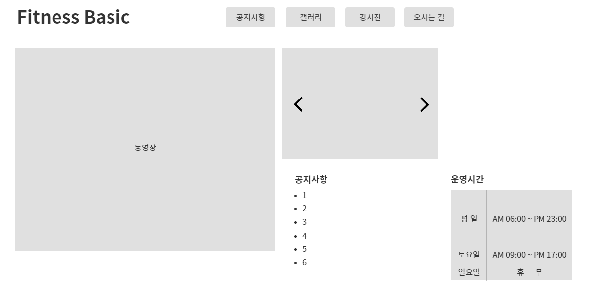
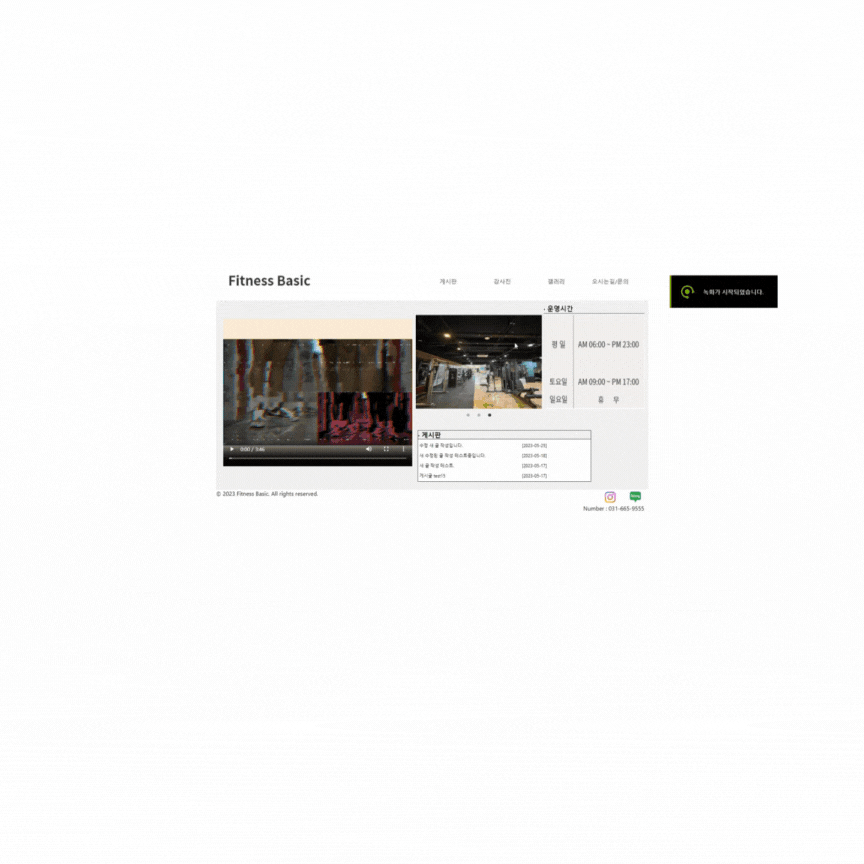

# Fitness_Basic
안녕하세요. 현재 다니고 있는 헬스장 홈페이지를 만들었습니다. 간단하게 홈, 게시판, 갤러리, 강사진, 오시는 길 탭이 있습니다.

실제 헬스장 홈페이지처럼 구축하려고 노력 중입니다. 추후 다른 기능들을 추가해가며 보완할 예정입니다.

# 계획

 

# 구동모습 

 

### 클라이언트 스펙
 - `React`
 - `JavaScript`

### 백엔드 스펙  
 - `Node.js`
 - `Express.js`
 - `MySQL`  
